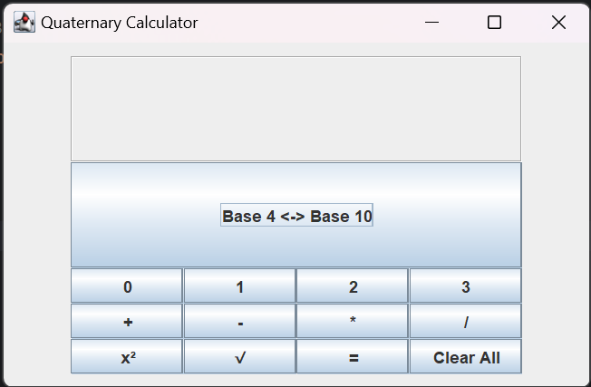
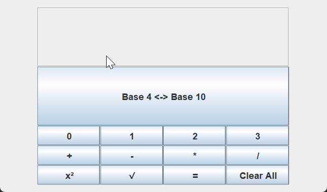
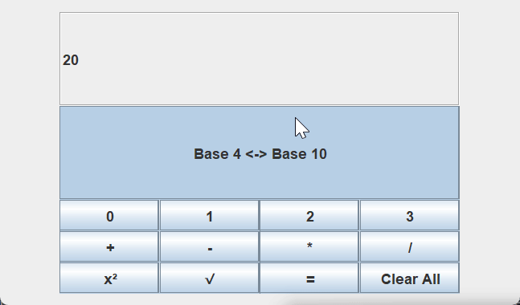

# Java Quaternary Calculator Using Swing
By Riley Jamison, Brooke Wright, Hunter Johns, and Payton Hutsell

## Instructions:
This is a simple Quaternary Calculator built with JFrame. A Quaternary Calculator
is a calculator for base 4 numbers. This means you will only have 0, 1, 2, and 3.

To run the program:
* Clone the repository
* Open the project in your choice of Java IDE
* Run the Main.java file

Once the program is running you will be presented with the calculator:

To perform operations, you can click on any of the buttons.
The options you have are addition, subtraction, multiplication,
division, square, and square root. Along with operands there is also
a big conversion button. This converts your results between base 4 and base 10.

After getting your result you have two options. You can
start a chain of operations using each result you get, or
you can start a new operation. To start a new operation you can use
the clear all button or you can click a number.

## Roles:
* Hunter Johns: Unit Testing
* Brooke Wright: GUI Structure
* Riley Jamison: Calculator Logic & UX
* Payton Hutsell: GUI support

## Team Meetings:

Meeting 1: 9/1/2024, 10:30 am
* Hunter and Brooke met in Bracken,
* Riley and Payton joined on Zoom.

DISCUSSION:
* Discussed future meeting time availability
* Discussed usages for the GUI, settled on Swing
* Created Git repository

Meeting 2: 9/3/2024, 12:05 pm
* Hunter and Brooke in the last 10 minutes of class

DISCUSSION:
* Discussed how to solve problem and decided architecture

Meeting 3: 9/3/2024, 5:00 pm
* Hunter, Brooke, and Payton all met in Robert Bell
* Riley joined online

DISCUSSION:
* Discussed work done since last meeting
* Discussed solution implementation
* Solved math behind conversion

Meeting 4: 9/4/2024, 3:00 pm
* Riley and Hunter met briefly at Bracken

  DISCUSSION:
* Discussed work done since last meeting
* Discussed solution implementation
* Discussed a new approach to conversions

Meeting 5: 9/5/2024, 5:00 pm
* Riley, Hunter and Brooke met in Robert bell
* Payton joined online

DISCUSSION:
* Discussed the lack of need for dedicated base 10/ base 4 conversions after finding built-in functions
* Discussed GUI and Logic separation

